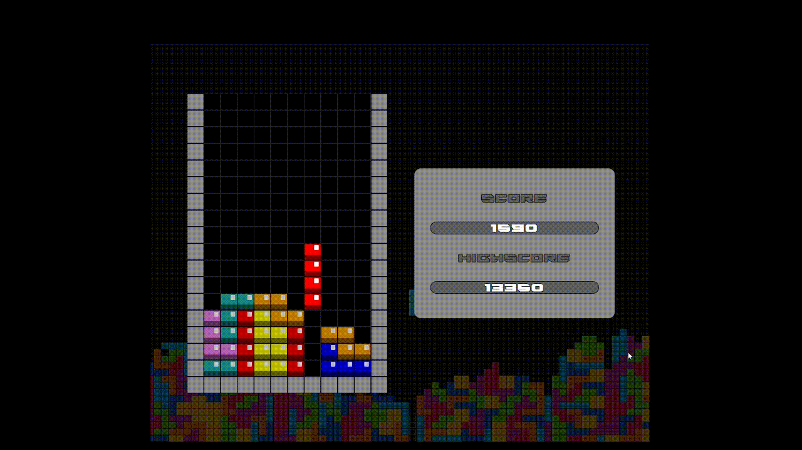

# tetris-js

Uma versão do jogo `Tetris` feita com HTML/CSS/JS.



## Primeiros passos

Para rodar este projeto localmente, siga os passos abaixo:

1. **Clone este repositório:**
    - ```git clone https://github.com/Joao-Vitor-Siqueira/tetris-js.git```
2. **Navegue até o diretório do projeto:**
    - ```cd tetris-js```
3. **Execute o programa:**
    - Localize o arquivo `index.html` no diretório do projeto.
    - Abra o arquivo `index.html` com o seu navegador preferido.
  
## Regras
  - Os **tetrominos** irão nascer nas **colunas superiores centrais**.
  - Os **tetrominos** irão **descer um nível** periodicamente.
  - Um **tetromino** será fixado quando chegar na **última linha** ou **colidir com outro bloco**.
  - Preencha todos os quadrantes de uma fila para formar uma **linha**.
  - Uma **linha** irá esvaziar todos os seus quadrantes e puxar as peças restantes para baixo.
  - Forme **múltiplas linhas** de uma vez para ganhar mais **pontos**.
  - A **velocidade** do jogo irá aumentar a cada 1000 **pontos** (max: 10000).
  - O jogo termina quando **não for possível gerar mais tetrominos**.

## Controles

- <kbd>&#8595;</kbd> Mover para baixo.
- <kbd>&#8594;</kbd> Mover para direita.
- <kbd>&#8592;</kbd> Mover para esquerda.
- <kbd>x</kbd> Rotacionar.

## Funcionalidades extras

- Salvamento de pontuação mais alta (relativo ao browser utilizado).
- Reinício rápido (não é necessário recarregar a página para reiniciar o jogo).