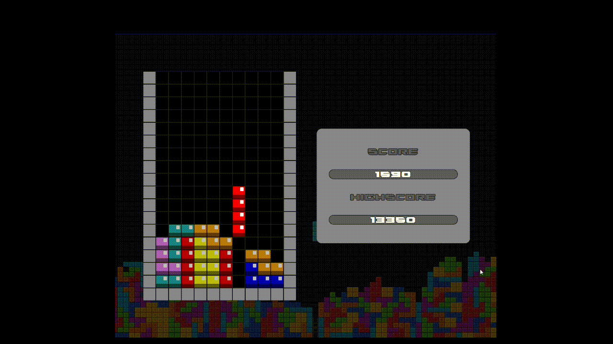

# tetris-js

A simple `Tetris` game made with HTML/CSS/JS.



Read this in other languages: [Português](README.PT.md).

## Getting Started

To run this project locally, follow these simple steps:

1. **Clone this repository:**
    - ```git clone https://github.com/Joao-Vitor-Siqueira/tetris-js.git```
2. **Navigate to the Project Directory:**
    - ```cd tetris-js```
3. **Open the game:**
    - Locate the `index.html` file in the project diretory.
    - Open `index.html` with your preferred web browser.
  
## Game Rules
  - The **tetrominos** spawn in the **top middle columns**.
  - The **tetrominos** will be **forced down** every game tick.
  - A **tetromino** will be fixed if it **cannot be forced down**.
  - Fill every square in a row to form a **line**.
  - A **line** will clear itself and pull the pieces above it down.
  - Form **multiple lines** at once to earn extra **points**.
  - The game **speed** will increase every 1000 **points** (up to 10000).
  - The game ends if it's **not possible to spawn more tetrominos**.

## Game Controls

- <kbd>&#8595;</kbd> Move down.
- <kbd>&#8594;</kbd> Move right.
- <kbd>&#8592;</kbd> Move left.
- <kbd>x</kbd> Rotate.

## Extra Features

- Highscore saving (relative to the current browser).
- Quick restart (no reload required to restart the game).
  
